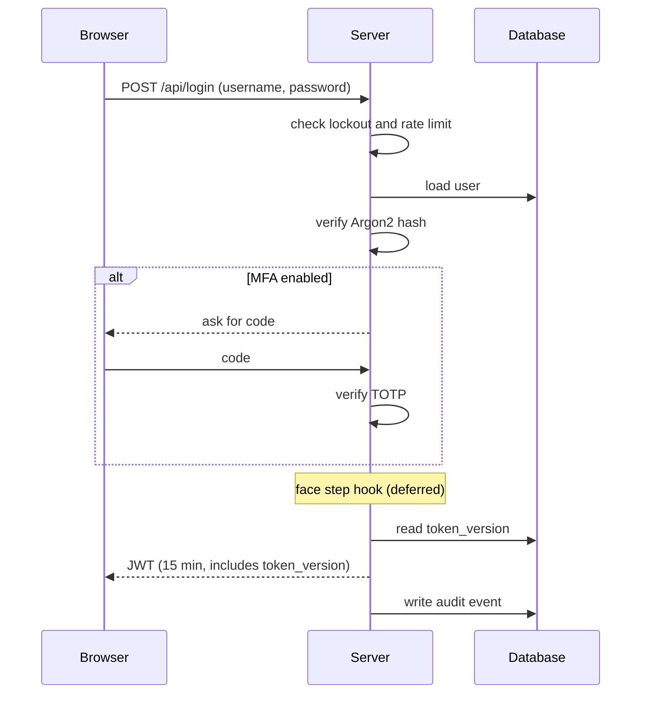

# SecureVault: Architecture

## Component diagram

```mermaid
flowchart LR
    U[User browser<br/>HTML + CSS + JS<br/>no frameworks] -->|JSON over HTTP(S)<br/>Bearer JWT| API

    subgraph Server[Flask application]
        API[Request layer<br/>size cap, security headers,<br/>error handler]
        API --> RL[Rate limiter<br/>lockout]
        API --> AUTH[Auth<br/>Argon2, TOTP MFA,<br/>JWT, password reset]
        API --> VAULT[Vault<br/>notes, images, cards]
        API --> ADM[Admin<br/>logs, users, stats]
        VAULT --> CR[Crypto<br/>AES-256-GCM]
        AUTH --> AUD[Audit log]
        VAULT --> AUD
        ADM --> AUD
    end

    CR -. loads keys .-> KEYS[(.secrets/<br/>vault_key, jwt_secret)]
    AUTH --> DB[(SQLite<br/>users, ciphertext, audit)]
    VAULT --> DB
    VAULT --> FS[(uploads/<br/>encrypted .bin files)]
    AUD --> DB
```

## Login flow



## Data protection at a glance

| Data | How it is stored |
|---|---|
| Password | Argon2 hash |
| MFA secret | Stored for the user, never returned after setup |
| Notes | AES-256-GCM ciphertext, bound to owner and id |
| Images | Encrypted bytes in a randomly named `.bin` file |
| Cards | Encrypted number, holder and expiry; token and last four digits; no CVV |
| Keys | Files in `.secrets/`, outside the database and outside Git |
| Sessions | JWT, 15 minutes, invalidated by `token_version` |

## Folder map

```
app/
  auth/       passwords, tokens, mfa, routes, password reset
  vault/      notes, images, cards
  admin/      logs, users, stats
  crypto/     keys, aes
  security/   ratelimit, audit, mailer
static/, templates/   frontend
tests/                threat-model, hardening and smoke tests
scripts/              hardening_check, scan_git_history, check_face_setup
docs/                 report, threat model, architecture, demo script
serve.py              production server (Waitress)
```
